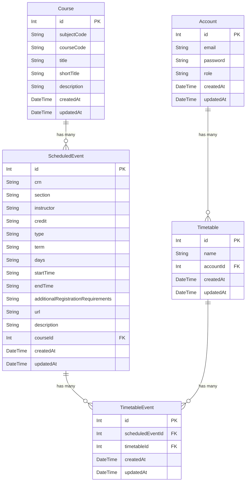

```mermaid
erDiagram
    Course {
        Int id PK
        String subjectCode
        String courseCode
        String title
        String shortTitle
        String description
        DateTime createdAt
        DateTime updatedAt
    }
    
    ScheduledEvent {
        Int id PK
        String crn
        String section
        String instructor
        String credit
        String type
        String term
        String days
        String startTime
        String endTime
        String additionalRegistrationRequirements
        String url
        String description
        Int courseId FK
        DateTime createdAt
        DateTime updatedAt
    }
    
    TimetableEvent {
        Int id PK
        Int scheduledEventId FK
        Int timetableId FK
        DateTime createdAt
        DateTime updatedAt
    }
    
    Timetable {
        Int id PK
        String name
        Int accountId FK
        DateTime createdAt
        DateTime updatedAt
    }
    
    Account {
        Int id PK
        String email
        String password
        String role
        DateTime createdAt
        DateTime updatedAt
    }

    Course ||--o{ ScheduledEvent: "has many"
    ScheduledEvent ||--o{ TimetableEvent: "has many"
    Timetable ||--o{ TimetableEvent: "has many"
    Account ||--o{ Timetable: "has many"

```
