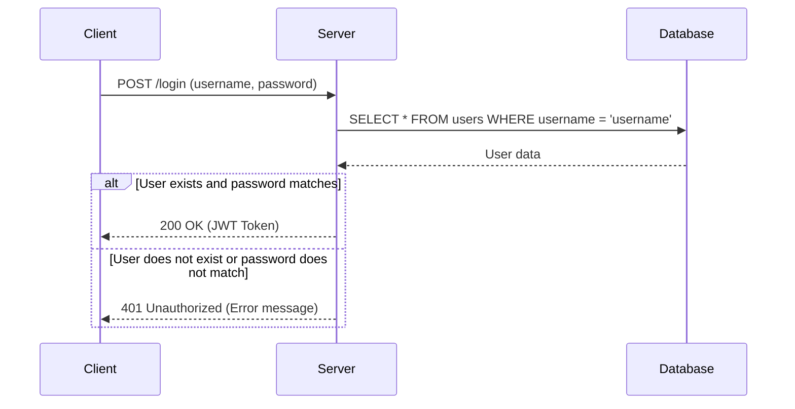

### Explanation
1. **Client** sends a POST request to the **Server** with the username and password.
2. **Server** queries the **Database** to find the user with the provided username.
3. **Database** returns the user data to the **Server**.
4. **Server** checks if the user exists and if the password matches:
   - If the user exists and the password matches, the **Server** responds with a 200 OK status and a JWT token.
   - If the user does not exist or the password does not match, the **Server** responds with a 401 Unauthorized status and an error message.

This sequence diagram provides a clear visualization of the login process, showing how messages are passed between the client, server, and database.